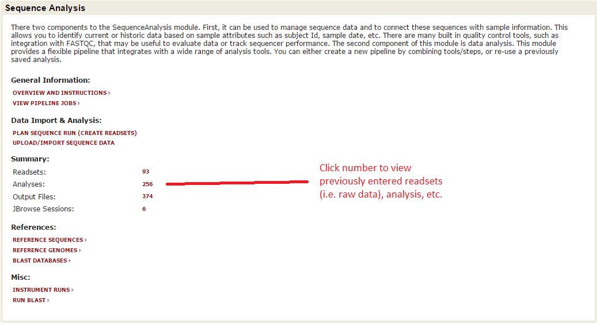
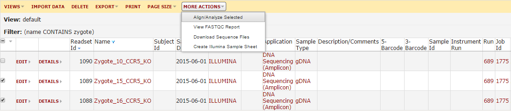
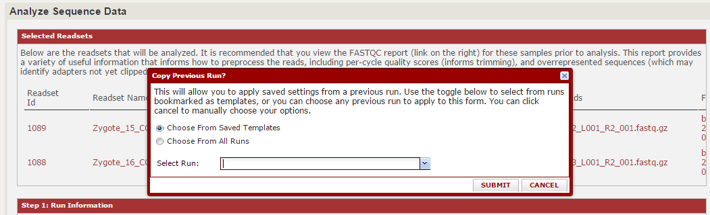
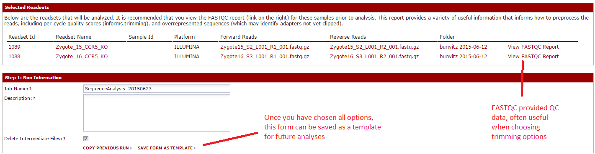
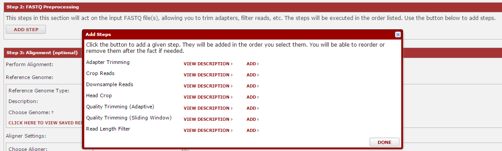
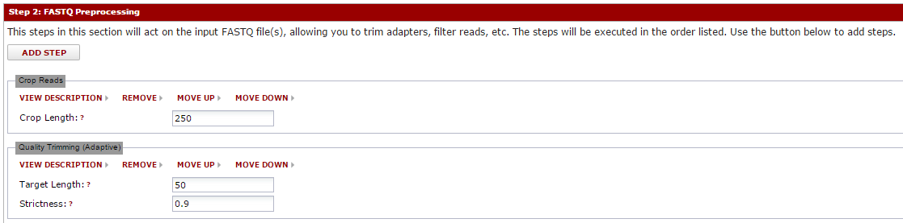
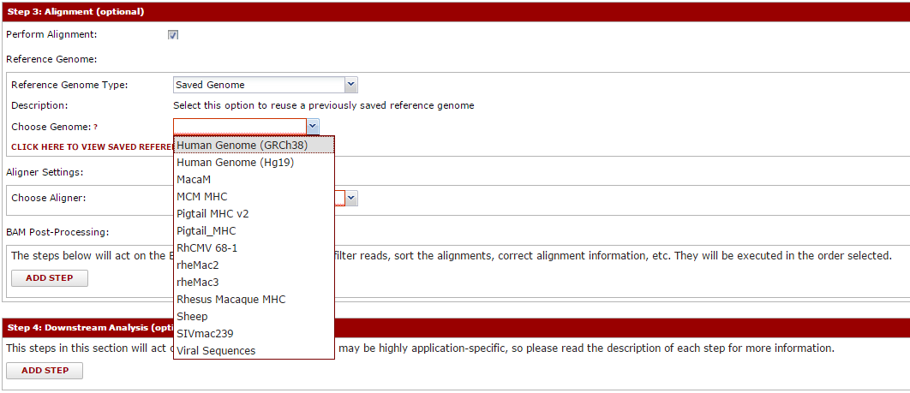
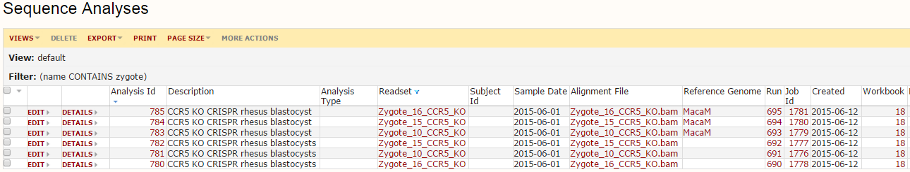
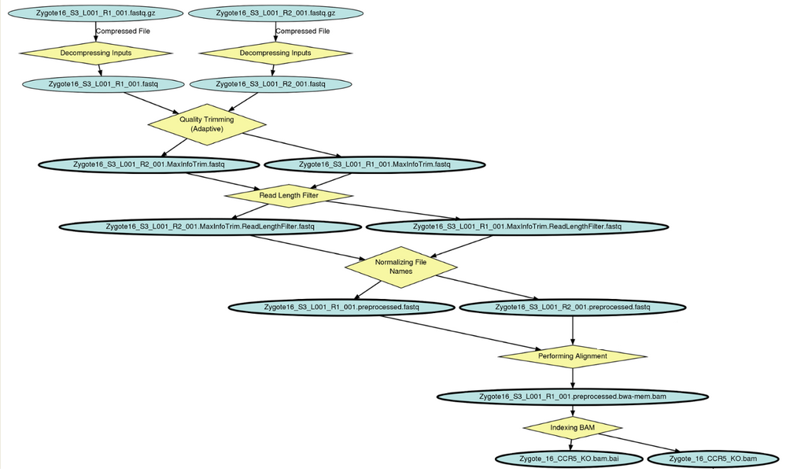

If you have configured your server for running pipeline jobs, this module can be used to directly run sequence analyses.  The primary benefits we believe this provides are:

* Allows non-bioinformaticians to perform many tasks
* Consistent, reproducible, yet flexible analyses
* Distribution of load (i.e. send jobs to a remote pipeline server or cluster)
* Automatic tracking of data provenance (i.e. what tools/commands were used to produce a file)
* All analyses are tightly linked to the raw data and samples.  This is in contrast to having a collection of files sitting somewhere on your lab's file store or post-doc's computer.

This pipeline is very tightly focused (although not exclusively) on the process of getting your raw reads processed and aligned against the reference genome.  We focus here because this is nearly universal, and we want to have a flexible, fault-tolerant, high-quality way to push data through these steps.  All data are archived with a full record of steps performed, which we have often found lacking in archived data.  Authors are able to add custom steps to this process, allowing lab-specific analyses.

These instructions describe the features of the module and how to use it once installed.  Because installing the analysis capabilities are tightly linked with the core LabKey Server data pipeline, please refer to the LabKey Server docs or post a question on the [LabKey forum](https://www.labkey.org/announcements/home/Developer/Forum/list.view?).  The authors of DISCVR monitor those forums and will reply to questions.  If you have questions about developing new tools that integrate with this module, please also use the forum as a start point.

To analyze your data, the reads must first be imported into the system.  [Follow these instructions if you have not already done so](management.md).  Once imported, click the 'Readsets' link on the DISCVR-Seq front page:

This will load a list of the imported sequence data.  You can filter this grid to find the sample(s) you want to analyze.  Once you find your samples, check the boxes next to them.  Next, click the 'More Actions' button and hit 'Align/Analyze Data'.  

From here, you will be prompted to either create a new workbook or save these analyses in a new workbook.  The workbook is similar to a subfolder, and allows you to group your analyses together.  Choose one of these.  Now the main analysis page will load.  The first prompt will ask you whether you want to repeat a saved analysis or make a new one.  If this is your first time here, you will not have any saved analyses.  However, as you use this module more we expect this will be the most common place you start.

For this example, hit cancel to close that window and we will choose option individually.  The first two sections should resemble the import page.  You can choose a run name/description, and you will see a summary of the files you selected.  For each file, you can open a FASTQC report, which gives QC information.

Next, you can walk through the sections where you choose the tools to run.  The first choices are for FASTQ pre-processing, which includes tools for quality trimming, downsampling of reads, etc.  To add a tool, hit the 'Add Step' button, then look over the available tools.  Click 'description' for more detail, or 'add' to add it.  You will choose parameters later.  Once you have added your tools, click 'Done'.  

After you hit done, the tools you selected will be visible in that section.  You can enter any parameters for that tool.  Note: if you hover over the question marks, you will usually get more information about that parameter.  The tools will execute in the order listed, and you can move them up/down as needed using the 'move up' and 'move down' links.  

You can apply this same idea to the remaining sections.  Next, you can pick the aligner and reference genome to align against.  Creating/managing reference genomes is described separately.  Many aligners are supported, and all are configured to produce a BAM file on completion.  You can select tools to further process this BAM (like Picard tool's MarkDuplicates or similar).  

The final section is simply called 'analyses'.  We tend to find that all the steps before this point are very generalized, and common to virtually all sequence pipelines.  However, most pipelines include some final or otherwise custom step that take the alignment and calculates something (usually the information you are most interested in seeing).  Are experience is that often these change frequently within a lab as well, meaning it is difficult to support them in a generalized pipeline.  Some analyses are included with this module (primarily driven by the research of the authors), and it is possible to add custom analyses to support your group.  Even if running a pipeline through this system only goes as far as alignment and BAM processing, there is still considerable value.  These steps are usually the most computationally intensive, and will run the in background.  The system will produce easily accessible files, and your scripts can perform custom analyses against them.  

By building a pipeline from these blocks, you have a high degree of flexibility in the process.  However, you can use the 'save as template' link near the top to snapshot your steps and allow you or others to repeat them in the future.

Once ready, hit the 'Start Analysis' button to run the pipeline.  This will run in the background, so you can walk away and/or check progress until complete.  To find the outputs, click the 'sequence analyses' link on the main page of the sequence module.  This will load a grid like below:

This is a record of all analyses performed.  Each connects back to the specific reference genome, readset (raw data), sample, etc.  If you click on the Run Id column, you can load a graph of the run, showing all steps performed:

All files are easily downloadable.  If you click on the alignment file name you can drill down to see the filepath (for example, if you want to script against it).  You can also use customize view to add a column showing fliepath, making it easier to operate on bulk sets of files.