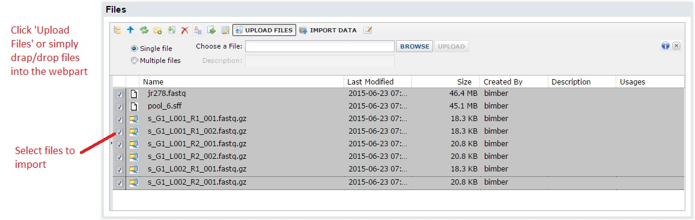

A key part of the sequence module involves managing your raw data and output files. All too often, a sequence project is just a collection of files on a hard disk. They are organized by the grad student or post doc into folders, and named using whatever conventions make sense at that time. This may be adequate for single projects, but the more data your labs collects, the more time you waste on menial tasks. It is also expensive to generate the data. Data managed through the system are readily searchable, making it practical to find and re-analyze data.

There are two ways to do this. If you have already generated the data and have the output files, click 'Upload Files / Start Analysis'. You can also use the system to plan a run ahead of time, in which case you can upload a spreadsheet of your sample information, barcodes/indexes, etc. For these instructions we will assume you are starting with the output files. 

After clicking, the system will ask you which workbook to use for the import. All data are organized into workbooks. You can think of these as folders within your project. It allows you to separate different datasets or projects. Note: you can always analyze or compare data stored in different workbooks, so this choice is not critical. At time of import, you can either create a new workbook or add to an existing one. 

After you click submit, you will see a standard LabKey files webpart. This allows you to select files from your computer to upload. Note: you can use the multi-file upload option to load multiple files and/or use drag & drop upload. 

Next, select the files you want to import, then click the 'Import Data' from the button bar. You should see a popup window where you can select 'Import sequence data'. 

The next form has many sections, but is fairly straightforward. Just walk through the sections in order.  In the 'Run Information' section, you can give your import a name and an optional description. The second section summarizes the files you selected to upload.  The top section will list the files you selected.  Next to each file, you have the option to run FASTQC (a tool that provides QC information) on your data.  Note: this tools runs in real time, so if you have very large files this might not be a good idea.  You will have the option to run it later as well.  

The third section allows you to choose how the original files are handled.  At time of import the pipeline will convert all input files to gzipped FASTQ files.  If you inputs are already gzipped, no processing is needed.  However, if we need to convert them the 'input file handling' option lets you choose whether to retain the original file or delete it.  The same applies if we need to de-multiplex your data.  By default, the pipeline will run FASTQC (described above) on your data and cache these results so you can more quickly view them later.  Note: if you hover over the question marks, more detailed information will appear about that option. 

The next step is usually more simple than it might look.  Sequence data are typically paired end (i.e. a pair of files that go together), and often a single sample is split across multiple lanes.  We need to determine which files are grouped together.  In the background the system will retain this information; however, you will usually be able to work with that collection of files as a single unit.  We do our best guess to group the files based on filename.  If your data were generated by Illumina and use their filename conventions (like the example below), it should group them correctly by sample/lane.  In this example, the files beginning with 's_G1' represent one sample split across 2 lanes.  The first lane (L001) has 2 pairs of FASTQ files and the second lane has one pair of FASTQs.  If your data are paired end, it is important to make sure the forward/reverse reads appear on the same line.  If the system does not guess the correct file grouping, you can click the 'populate/reorder' files button to have the system fill out your files in a different order.

The most important step if the section where you enter sample information. The general idea is that we need to capture the relevant sample attributes, such as subject name, sample type, sequencing platform, etc.  Most of these are optional, but any information you enter now many help you search and identify these data later. You can edit these after the fact as well.  In this example, even though we chose 8 files, these were grouped into three file groups (mostly because of the Illumina 's_G1' files).  

Note: if you have many samples, you can hit 'Bulk Edit' to change rows in bulk.  As an example, it is common to bulk edit to set the platform to ILLUMINA or similar.  You can also use the 'Apply Metadata from Spreadsheet' button for large imports.  If you use this option, the system will let you download an excel file with one row per sample.  You can fill out the fields and then cut/paste the information back into the system.

After you are done with your samples, click 'Import Data' to import. During import, the system will normalize your sequence files. This means it that while you could import multiple sequence formats, all imported data will be converted to FASTQ (standard encoding) and compressed to save space. Most next-gen sequence will already be in FASTQ format, but this step is can be helpful so downstream analyses do not need to bother with format conversions. Once complete, your new readsets will appear on the summary: 

You can click on the readset number to view your data. The image below shows an example with 99 imported. This grid operates like any other LabKey grid. This means you are able to click on the column headers to sort or filter, allowing easy search across all your data. Note: the 'More Actions' button will have many additional options, such as the ability to download the data or running FastQC (a tool to generate a summary report) on your data. 

