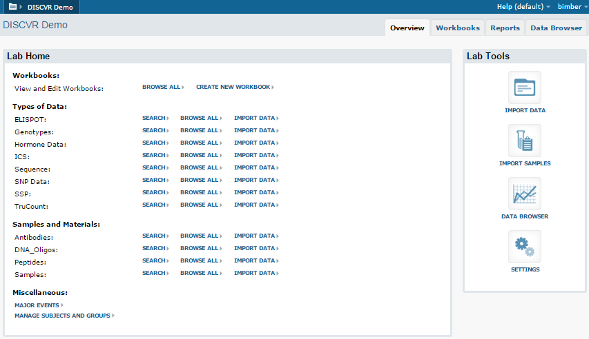
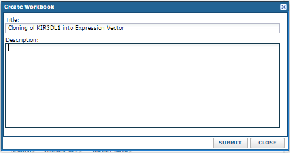
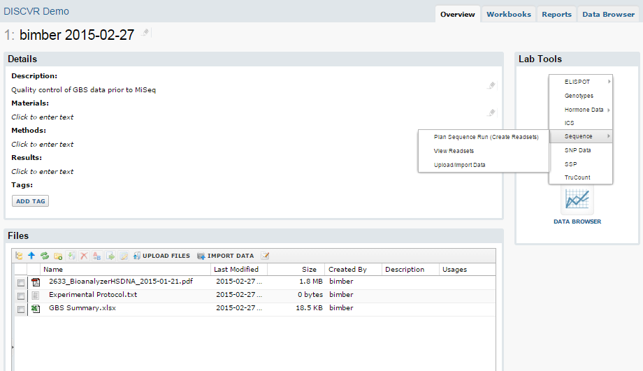
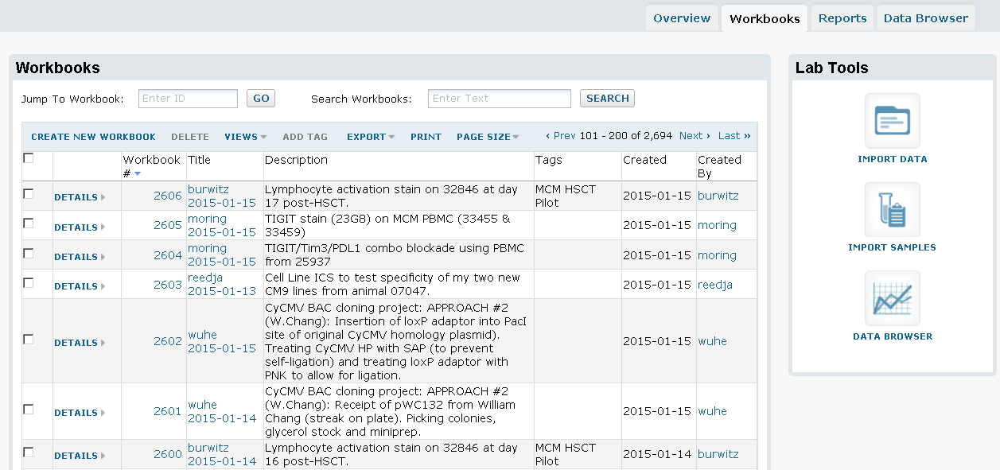

##DISCVR Features

DISCVR has evolved from years of trying to manage data within an academic lab.  It is built by taking features of LabKey and combining/augmenting them.  We want to let the lab store information in a useful form (ie. something better than a sprawling network folder), without anyone needing to spend a lot of time managing it.  The system can be used with next to no customization, and can evolve over time to store more specific data based on your group's needs.  Each group will have a homepage listing the types of data they choose to store.  There are links to view each category of data, and tabs along the top to view workbooks (described below), or view reports.

There are two sides to the system.  The first will let you manage any files and raw data you create.  It could be though of vaguely like an electronic lab notebook, but it really is not designed as that.  Virtually everything uploaded into the system is uploaded into a workbook.  A workbook is essentially a folder within your group's section.  Workbooks can have a name, description, and are given a number.  There are two ways to use them.  Each workbook can represent an experiment or series of experiments (akin to a page in your notebook).  It will hold all the files and data creates from that work. Alternately, a single workbook could hold data from a large project (ie. a grant or paper).  There's no right or wrong approach.  Any files can be uploaded into a workbook.  Any text files you upload will be indexed and searchable.  When importing data, most of the time you will be prompted to either create a new workbook or add to an existing one:

Within each workbook, you can type basic detail about you work, and upload any type of file (note: you can drag/drop files into the file area):

This gives your group an easily searchable list of all your experiments/projects.  You can either use the search box to search within any file you have uploaded, or click the column headers to filter specifically within the title or description:

